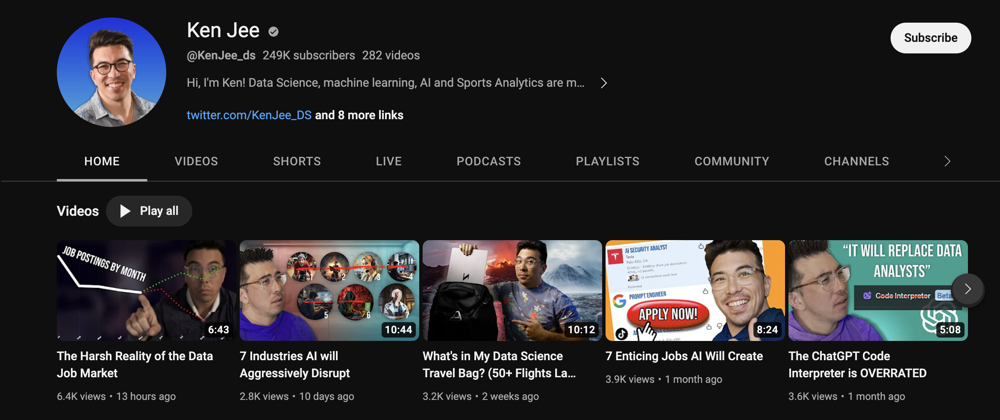
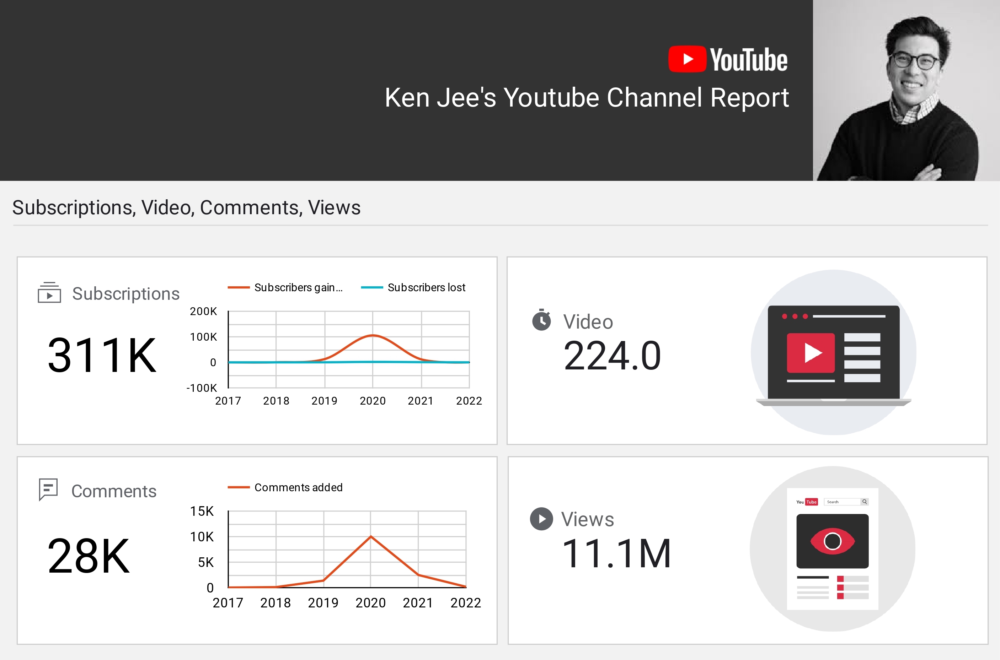

# YouTube Channel Data Driven Sponsorship Dashboard

2020 marked a significant year for Ken's YouTube journey, with an impressive 113 video uploads. However, this number decreased to 47 in 2021. A closer examination of video metrics reveals intriguing patterns.

**Crucially, for potential sponsors:** The CPM (USD) distribution pivots around $10, hinting at a lucrative avenue for collaboration. Imagine the reach and impact your brand could achieve, with Ken's content potentially generating around $10 per thousand views through ads. However, for an even more insightful financial portrayal, the RPM (USD) distribution becomes pivotal, as it encapsulates the actual net profit, considering YouTube's substantial share. Notably, Ken's videos tend to yield an RPM of around $5, providing a more accurate gauge of the revenue generation potential that your sponsorship could tap into.

One video that stands out is "How I would Learn Data Science (if I Had to Start Over)" with around 47k likes, emerging as Ken's most viewed and appreciated content. The strong correlation between Views and Subscribers gained/lost aligns with expectations. Interestingly, videos like "Why I Quit Data Science" exhibit substantial Subscriber loss but don't appear among top Subscribers gained, as they often receive mixed engagement.

Views predominantly originate from the United States (1,354,450) and India (1,155,510), contributing to Ken's channel's million total views.

**Recommendation:** Collaborations with fellow YouTubers/Content Creators could greatly benefit Ken. Given the growing Data Science community's expanding interest, live collaborations could attract new audiences to Ken's channel, driving exploration of older content and encouraging subscriptions.

*In summary,* this analysis delved into a limited set of metrics. Different metrics may matter based on a creator's audience, subject, and goals. Expect potential updates and improvements in the future as I continue exploring YouTube analytics.

Find Ken Jee's YouTube channel [here](https://www.youtube.com/channel/UCiT9RITQ9PW6BhXK0y2jaeg) 📺. For a visual representation of this project, check out the [here](https://lookerstudio.google.com/reporting/20a5d1ed-a5dc-4fac-8b77-44da035979a3) 📊.

